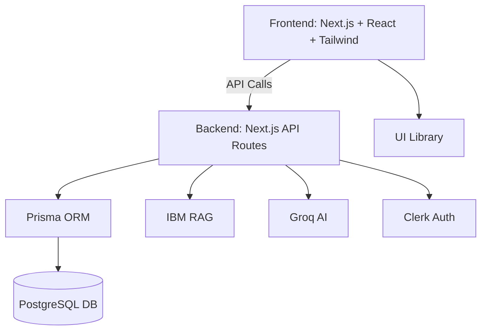

# 🚀 IntelliLearn360


---

## 🌟 Overview

**IntelliLearn360** is a unified, modern educational platform that empowers learners with personalized learning paths, real-time AI tutoring, hands-on project experiences, and comprehensive career development tools. Built with the latest web technologies and enhanced by IBM's Retrieval-Augmented Generation (RAG), it bridges the gap between learning and career success.

---

## ✨ Key Features

- 🎯 **Personalized Learning Paths**: Adaptive courses and modules tailored to each learner.
- 🤖 **AI-Powered Tutoring**: Real-time, context-aware support using IBM RAG and Groq AI.
- 📝 **Hands-on Projects**: Practical, portfolio-building project experiences.
- 🚀 **Career Development**: Job search, skill assessment, and resume tools.
- 📊 **Progress Tracking**: Visual dashboards and analytics for learners.
- 🔒 **Secure Authentication**: Powered by Clerk.
- 🌗 **Modern UI/UX**: Responsive, accessible, and beautiful design.

---

## 🏗️ Architecture Blueprint



---

## 🤖 Role of Gen AI (IBM RAG)

- Powers the AI tutor for real-time, context-aware answers.
- Retrieves relevant info from curated knowledge sources.
- Combines retrieval with generative AI for accurate, reliable support.
- Enhances learning, project guidance, and career advice.

---

## 🛠️ Technologies Used

- **IBM RAG**: Retrieval-Augmented Generation for AI tutoring
- **Next.js & React**: Modern frontend framework
- **TypeScript**: Type-safe development
- **Tailwind CSS & Radix UI**: Modern, accessible UI
- **Prisma & PostgreSQL**: Robust data management
- **Clerk**: Secure authentication
- **Groq API**: Generative AI
- **Turborepo**: Monorepo management

---

## 🚦 Getting Started

1. **Clone the repo:**
   ```bash
   git clone https://github.com/prajwal-pl/edtech-production
   cd edtech-production
   ```
2. **Install dependencies:**
   ```bash
   npm install
   ```
3. **Set up environment variables:**
   - Copy `.env.example` to `.env` and fill in your secrets (DB, Clerk, Groq, IBM RAG, etc.)
4. **Run the development server:**
   ```bash
   npm run dev
   ```
5. **Open in browser:**
   - Visit [http://localhost:3000](http://localhost:3000)

---

## 📂 Monorepo Structure

- `apps/web` — Main Next.js app
- `packages/ui` — Shared UI components
- `packages/eslint-config` — Shared linting rules
- `packages/typescript-config` — Shared TypeScript configs

---

## 💡 Contributing

We welcome contributions! Please open issues or pull requests for suggestions, bug fixes, or new features.

---

## 📄 License

[MIT](LICENSE)

---

> Built with ❤️ by the IntelliLearn360 Team
